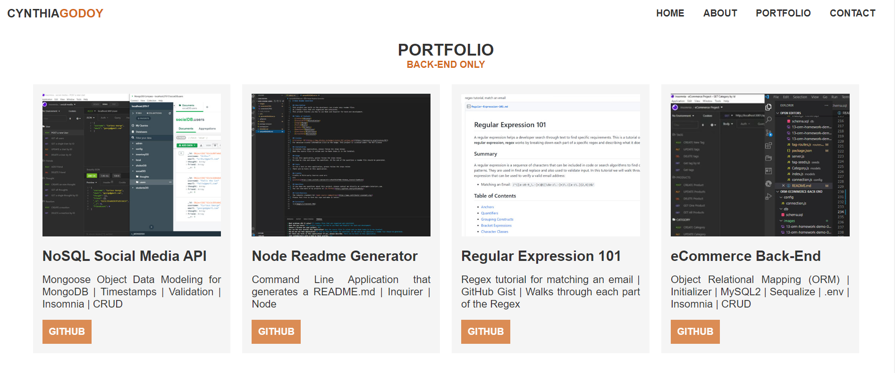
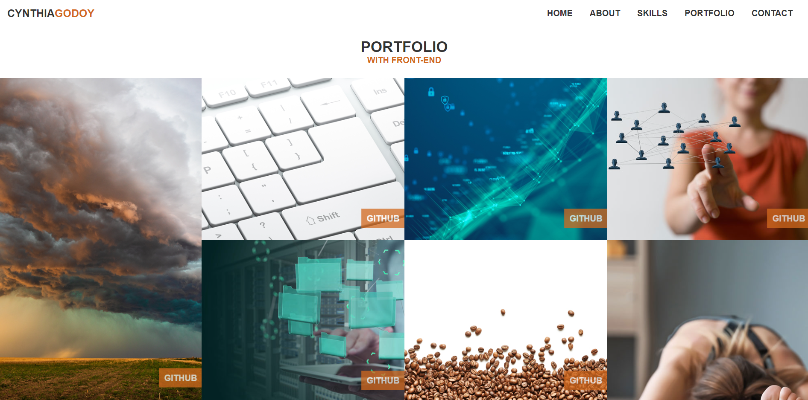

# React.js Portfolio

## Description
A single portfolio page showcasing a developers work using **create-react-app** that is deployed using `gh-pages`.

## Deployed URL
[Cynthia Godoy's React.js Portfolio](https://cynthiagodoy.github.io/react.js-portfolio/)

## Installation

1. To install react packages: [Getting Started with React App](https://create-react-app.dev/docs/getting-started/)
```
npx create-react-app react.js-portfolio
```

2. To install [react router](https://www.npmjs.com/package/react-router)
```
npm install react-router-dom
```

3. To install [react icons](https://www.npmjs.com/package/react-icons)
```
npm install react-icons
```

4. To install [react hash router](https://www.npmjs.com/package/react-router-hash-link)
```
npm install --save react-router-hash-link
```

5. [Create React App Docs on GitHub Pages](https://create-react-app.dev/docs/deployment/#github-pages). **Note**: `gh-pages` requires a seperate build that can be deployed. To reupload any changes to gh-pages, first remove `.cache>gh-pages` inside the node modules. Then you can npm run deploy again.

## Usage
Inside the directory, react can run several commands:

`npm start` starts the development server

`npm test` starts the test mode

`npm run build` bundles the app into static file for production

`npm eject` will remove the tool and copies build dependencies, configuration files and scripts into the app directory. If you do this you can't go back!

## Items Completed

✅ The `Navbar` navigates to sections of the portfolio with the current section highlighted and appears on multiple pages.

✅ The `About Me` section includes a photo of the developer. The `Resume` button contains a downloadable resume and a list of developers proficiencies.

✅ The `Portfolio Front End` section includes a CSS grid with hover effect of Front End work.

✅ The `Portfolio Back End` section includes a React Carousel with Back End and CLI's.

✅ The `Contact` section contains a contact form with fields for name, email address, and a message. **Note:** This is currently hooked up to EmailJS and is working correctly.

✅ The `Footer` section contains the icon links to the developer's GitHub, Linkedin, and a profile to a third platform.

## Credits
[Tech2 React JS Crash Course](https://www.youtube.com/watch?v=0h2b4ftbZcU&ab_channel=Tech2etc)

## Screenshot


